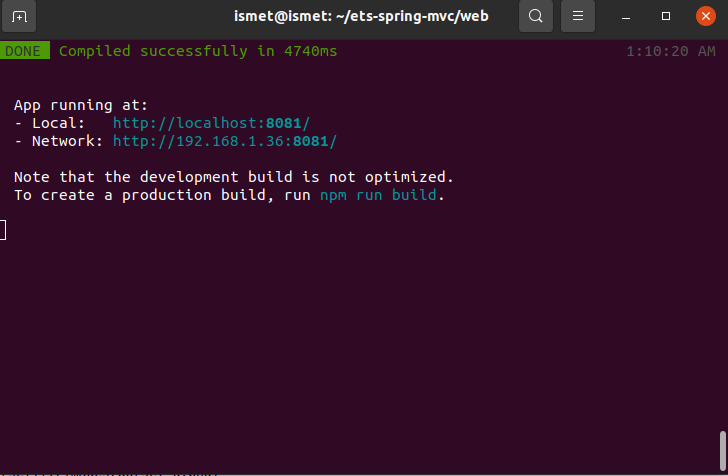
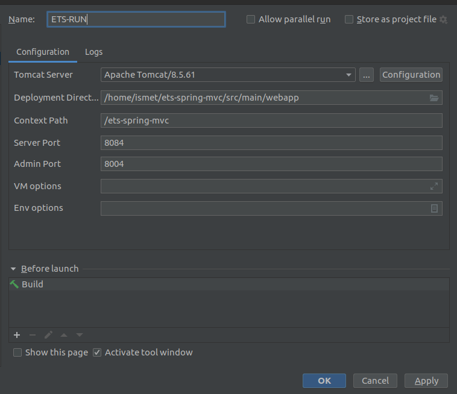
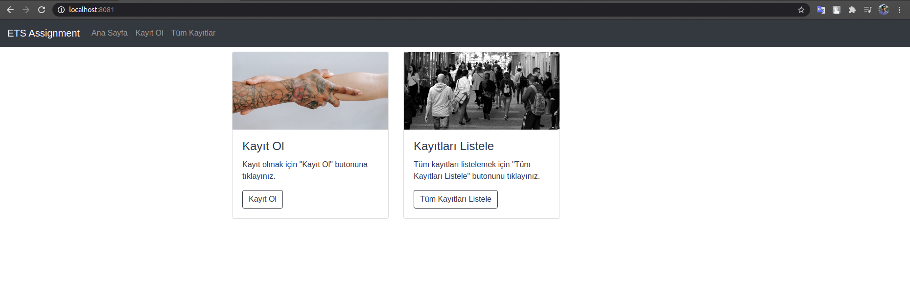
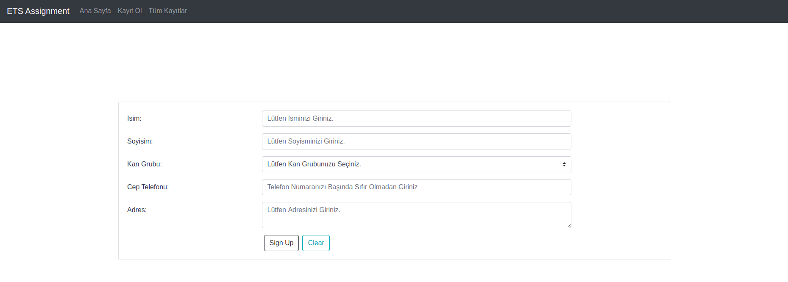
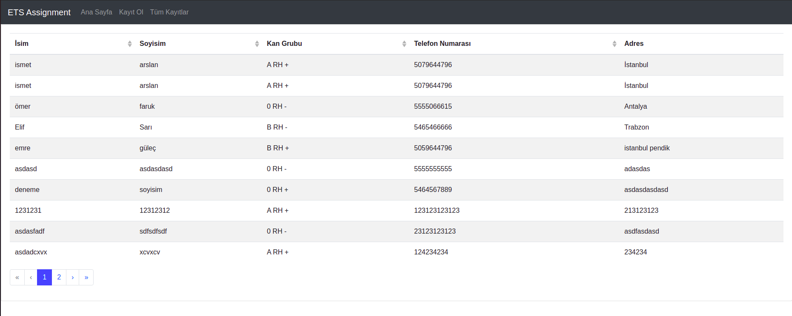
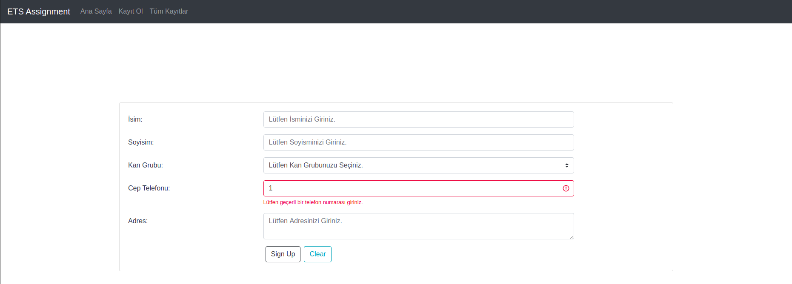
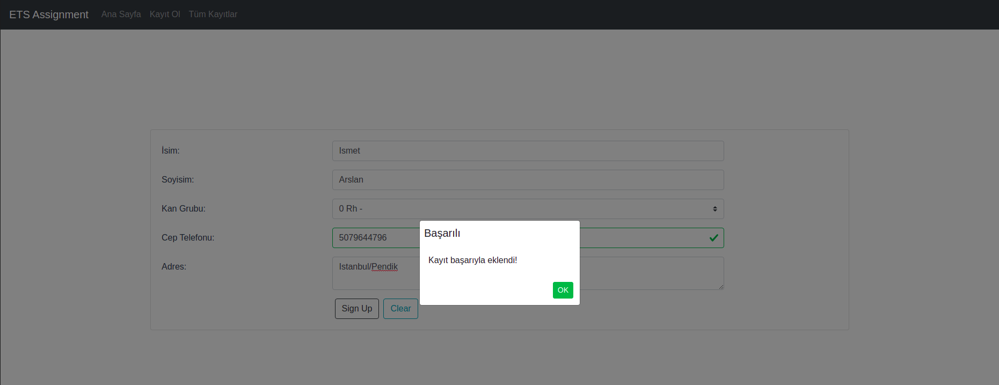
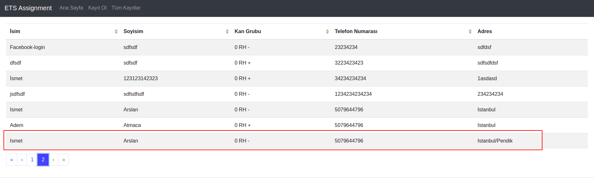

# ets-assignment
ETS Tur için hazırlanmış demo projedir.

Uygulamanın çalışması için bilgisayarınızda aşağıdakilerin kurulu olması gerekli;

- Java 1.8
- Maven 3.x
- VueJS
- npm
- docker
- lombok
- Intellij Idea (Tercihen)

Uygulamayı klonladıktan sonra VueJS tarafının ayağa kalkması için aşağıdaki adımları izleyebilirsiniz;

Terminalden uygulamanın klonlandığı dizin içerisindeki web klasörüne gittikten sonra aşağıdaki komutu çalıştırın;


```bash

 npm run serve

```

Bu komuttan sonra aşağıdaki gibi bir görüntü ile karşılaşmanız gerekmekte. 
**Herhangi bir hata aldığınız durumda package-lock.json dosyasını silip tekrar komutu çalıştırmayı deneyebilirsiniz.



Daha sonra docker dosyasını ayağa kaldırmamız gerekmekte;

<Proje dizini>/src/main/resources/ dizinine geldikten sonra aşağıdaki komutu çalıştırabilirsiniz;

```bash

 sudo docker-compose -f docker-compose.yml up

```

Tomcat Server bilgileri aşağıdaki gibi olmalıdır;



## Ekran Görüntüleri

uygulamanın ilk açıldığı hali;


Kayıt ekranı;


Tüm Kayıtların listelendiği ekran;


Örnek validasyon;


Kayıt eklendikten sonra ki popup uyarısı;


Eklenen kaydın listelenmesi;



## POST Servis Kullanımı

GET Servis URL = http://localhost:8084/ets-spring-mvc/api/all-records

Örnek Cevap;

```json

{
    "status": true,
    "message": "Ok",
    "records": [
        {
            "id": "600f2f5889f6316d36257a68",
            "name": "ismet",
            "surname": "arslan",
            "blood_type": "A RH +",
            "phone_number": "5079644796",
            "address": "İstanbul",
            "status": false,
            "message": null
        },
        {
            "id": "600f3c6e89f6317e2e0d7926",
            "name": "ömer",
            "surname": "faruk",
            "blood_type": "0 RH -",
            "phone_number": "5555066615",
            "address": "Antalya",
            "status": false,
            "message": null
        },
	...        
        
```

POST Servis URL = http://localhost:8084/ets-spring-mvc/api/insert-new-record

Örnek İstek;

```json

{
    "name" : "Ets",
    "surname" : "Tur",
    "blood_type" : "BN",
    "phone_number" : "5465466666",
    "address" : "Trabzon"
}
        
```

Örnek Cevap;

```json

{
    "id": "601095f3e6fb064e555f4775",
    "name": "Ets",
    "surname": "Tur",
    "blood_type": "BN",
    "phone_number": "5465466666",
    "address": "Trabzon",
    "status": true,
    "message": null
}
        
```


